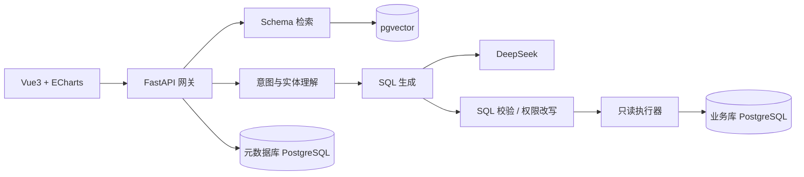

<div align="center">

# Text2SQL 智能数据分析平台

**用自然语言查询数据库，即刻生成图表与结论**

[](https://github.com/Littlewit/Text2SQL/actions/workflows/ci.yml)


</div>

---

## 项目简介

面向非技术人员的智能数据分析平台：业务人员用中文提问（如「上个月哪个店铺 GMV 最高？」），
平台自动完成 **意图理解 → Schema 检索 → SQL 生成 → 安全校验 → 执行 → 图表渲染** 的完整链路，
并以「结论 + 图表 + SQL 解释 + 口径声明」四要素呈现结果。

### 核心特性

- **对话式查询** — 多轮上下文继承、建议追问、流式阶段反馈（SSE）
- **Text2SQL 引擎** — DeepSeek + Few-shot 动态召回 + 指标口径归一化 + Schema 混合检索（pgvector）
- **纵深防御** — AST 级 SQL 校验白名单、行级权限注入、敏感字段脱敏、只读账号、限流熔断
- **运营闭环** — 查询历史/收藏/分享、Few-shot 样例库、评测回归门禁、全量审计日志
- **同构部署** — 全环境统一 PostgreSQL + pgvector（含向量检索），Docker Compose 一键启动

## 架构



## 快速开始

> 前置条件：[Docker](https://docs.docker.com/desktop/)（数据库必须走容器）、Python 3.10+、Node 18+

```bash
# 1. 克隆
git clone https://github.com/Littlewit/Text2SQL.git
cd Text2SQL

# 2. 启动基础设施与后端（首次自动构建）
docker compose -f docker-compose.dev.yml up -d

# 3. 执行数据库迁移（启用 pgvector）
cd backend
pip install -e ".[dev]"
alembic upgrade head

# 4. 启动前端（另开终端）
cd ../frontend
npm install
npm run dev   # http://localhost:5173
```

后端 API 位于 `http://localhost:8000/api/v1`，开发模式下交互式文档见 `/docs`。

## 项目结构

```text
├── backend/                  # FastAPI 后端
│   ├── app/api/v1/           #   路由层（参数校验与编排）
│   ├── app/core/             #   配置 / 安全 / 依赖注入 / 追踪
│   ├── app/services/         #   核心业务（NLU、检索、生成、校验、执行）
│   ├── app/infra/            #   ORM 模型与数据库引擎
│   ├── alembic/              #   迁移（仅 PostgreSQL 方言）
│   └── tests/                #   单元 + 集成测试
├── frontend/                 # Vue3 + TS 前端
├── docker-compose.dev.yml    # 开发环境编排
└── .github/workflows/        # CI 流水线
```

## 开发

```bash
# 后端测试与检查
cd backend
pytest -m "not integration"   # 单元测试（无外部依赖）
pytest -m integration         # 集成测试（需 Docker，真实 PG + pgvector）
ruff check .

# 前端
cd frontend
npm run dev                   # 开发服务器
npm run build                 # 类型检查 + 构建
```

## 文档

完整产品与技术文档存放于本地 `.codebuddy/docs/`（不入库）：

| 文档 | 说明 |
|---|---|
| 详细需求文档 v1.1 | 8 大模块、130 条功能需求、非功能指标与验收标准 |
| 系统设计 v1.0 | 架构、核心链路、数据库 DDL、API 契约、部署设计 |
| 下一步任务计划 | T0~T6 任务包拆解与进度 |

## Roadmap

- [x] T0 — 项目脚手架与环境基线
- [ ] T1 — 认证 / 角色 / 审计底座
- [ ] T2 — Schema 管理与元数据链路
- [ ] T3 — Text2SQL 查询主链路
- [ ] T4 — 可视化与前端对话界面
- [ ] T5 — 评测体系与安全加固
- [ ] T6 — 生产部署交付

## 安全说明

平台对业务数据库**严格只读**；LLM 输出零信任，所有 SQL 必须通过 AST 白名单校验、
权限改写与行数限制后方可执行。详见需求文档 §9 安全与合规。

---

<div align="center">

Built with FastAPI · SQLAlchemy 2.0 · LangChain · pgvector · Vue3

</div>
