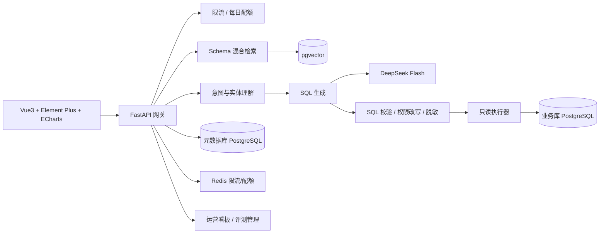

<div align="center">

# Text2SQL 智能数据分析平台

**用自然语言查询数据库，即刻生成图表与结论**

[](https://github.com/Littlewit/Text2SQL/actions/workflows/ci.yml)


</div>

---

## 项目简介

面向非技术人员的智能数据分析平台：业务人员用中文提问（如「上个月哪个店铺 GMV 最高？」），
平台自动完成 **意图理解 → Schema 混合检索 → SQL 生成 → AST 安全校验 → 权限改写 → 只读执行 → 脱敏 → 图表渲染**
的完整链路，并以「结论 + 图表 + SQL 解释 + 口径声明」四要素呈现结果。

### 核心特性

- **对话式查询** — 多轮上下文继承、建议追问、流式阶段反馈（SSE）
- **Text2SQL 引擎** — DeepSeek Flash + Few-shot 动态召回 + 指标口径归一化 + Schema 混合检索（pgvector，表配额保底 + 聚合加分）
- **纵深防御** — AST 级 SQL 校验白名单、行级权限注入（union/intersect 可配）、列级角色隐藏、敏感字段脱敏、只读账号、QPS/并发限流、每日配额、熔断
- **运营闭环** — 运营看板（成功率/耗时分布/重试率/Token 用量）、查询历史/收藏/分享、Few-shot 样例库与反馈采纳、审计日志（不可篡改 + 保留期清理）
- **质量门禁** — 231 条评测基线（安全/召回 100%）、回归对比报告、覆盖率 ≥70%
- **同构部署** — 全环境统一 PostgreSQL + pgvector（含向量检索），Docker Compose 一键启动

### 评测基线（M3-T1）

| 维度 | 通过率 |
|---|---|
| 安全拦截（写库/危险函数/注入/系统表） | 100% |
| 表召回（top-10 全命中） | 100% |
| 越界拒答 / 时间解析 | 100% |
| **执行结果一致（EX）** | **95%+** |
| 意图识别 | 88% |
| **整体** | **97.4%**（231 条，真实 LLM） |

## 架构



## 快速开始

> 前置条件：[Docker](https://docs.docker.com/desktop/)（数据库必须走容器）、Python 3.10+、Node 18+

```bash
# 1. 克隆
git clone https://github.com/Littlewit/Text2SQL.git
cd Text2SQL

# 2. 启动基础设施（PostgreSQL pgvector + Redis；PG 映射宿主机 5433）
docker compose -f docker-compose.dev.yml up -d

# 3. 后端依赖与迁移
cd backend
python -m venv .venv
.venv\Scripts\activate
pip install -e ".[dev]"
copy .env.example .env
alembic upgrade head

# 4. 示例业务库与语义层种子（评测/演示数据）
psql -h localhost -p 5433 -U t2s -d postgres -c "CREATE DATABASE demo_business"
psql -h localhost -p 5433 -U t2s -d demo_business -f scripts/demo_business.sql
# 在管理后台接入数据源 demo_business 并完成扫描后：
python scripts/seed_eval_meta.py
python scripts/seed_few_shots.py

# 5. 启动后端（统一入口，处理 Windows 事件循环兼容）
python run.py

# 6. 前端（另开终端）
cd ../frontend
npm install
npm run dev
```

后端 API 位于 `http://localhost:8000/api/v1`，交互式文档见 `/docs`。
内置账号：`admin / admin123`（首启强制修改）。内置角色：`R-BIZ` 业务用户、`R-DA` 数据分析、`R-AD` 管理员、`R-AU` 审计员。

## 项目结构

```text
├── backend/                  # FastAPI 后端（见 backend/README.md）
│   ├── app/api/v1/           #   路由层（认证/查询 SSE/管理后台/运营）
│   ├── app/core/             #   配置/安全/限流/配额/结果缓存
│   ├── app/services/         #   NLU、检索、生成、sql_guard、权限、脱敏、执行、图表、评测
│   ├── app/infra/            #   ORM 模型与数据库引擎
│   ├── app/llm/              #   LLM / Embedding 适配层（可替换）
│   ├── alembic/              #   迁移（0001~0010，仅 PostgreSQL 方言）
│   ├── eval/                 #   评测框架（231 条用例、runner、基线）
│   ├── scripts/              #   示例库/语义层/Few-shot 种子脚本
│   └── tests/                #   单元 + 集成测试（真实 PG）
├── frontend/                 # Vue3 + Element Plus 前端（见 frontend/README.md）
├── docker-compose.dev.yml    # 开发环境编排
├── docker-compose.yml        # 生产编排
└── .github/workflows/        # CI 流水线（lint/测试/覆盖率门禁）
```

## 开发

```bash
# 后端测试与检查
cd backend
pytest -m "not integration"                    # 单元测试（无外部依赖）
pytest -m integration                          # 集成测试（需 Docker，真实 PG + pgvector）
pytest -m "not integration" --cov=app --cov-append
pytest -m integration --cov=app --cov-append --cov-fail-under=70   # 覆盖率门禁（实测 75.7%）
ruff check .

# 评测（真实 LLM，需 DEEPSEEK_API_KEY）
python -m eval.run --offline                   # 离线安全类别（CI 门禁，100% 红线）
python -m eval.run                             # 全量（与 baseline.json 对比）
python -m eval.run --kinds sql_exec,recall     # 指定类别

# 前端
cd frontend
npm run dev
npm run build
```

## 文档

完整产品与技术文档存放于本地 `.codebuddy/docs/`、任务计划于 `.codebuddy/plans/`（不入库）：

| 文档 | 说明 |
|---|---|
| 详细需求文档 v1.1 | 8 大模块、130 条功能需求、非功能指标与验收标准 |
| 系统设计 v1.0 | 架构、核心链路、数据库 DDL、API 契约、部署设计 |
| M1/M2 任务计划 | T0~T6、M2-T1~T6 任务包拆解与完成记录 |
| M3 任务计划 | 质量冲刺 / 对话深化 / 生产就绪（进行中） |

## Roadmap

- [x] **M1** — 脚手架 / 认证底座 / Schema 管理链路 / 查询主链路 / 可视化 / 示例库与安全评测
- [x] **M2** — 数据闭环 / SQL 增强 / 权限精细化 / 可视化导出 / 运营看板 / 评测基线（89.2%）
- [x] **M3-T1** — 生成质量冲刺（评测基线 97.4%，EX 95%+）
- [ ] M3-T2 — Embedding 真模型接入（bge-large-zh）
- [ ] M3-T3 — 对话式分析深化（多轮改写 / 对比问题）
- [ ] M3-T4 — Celery 异步任务与性能
- [ ] M3-T5 — 生产化部署（一键初始化 / 备份 / 监控）
- [ ] M3-T6 — UAT 与交付验收

## 安全说明

平台对业务数据库**严格只读**；LLM 输出零信任，所有 SQL 必须通过 AST 白名单校验、
权限改写与行数限制后方可执行；敏感值在服务端出口统一脱敏后才进入前端与导出；
密钥仅经环境变量注入（`DEEPSEEK_API_KEY`），数据源凭据 AES-GCM 加密存储。详见需求文档 §9 安全与合规。

---

<div align="center">

Built with FastAPI · SQLAlchemy 2.0 · pgvector · Vue3 · Element Plus · ECharts

</div>
